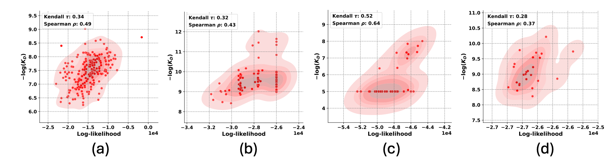

# DiffAbXL: 
##### Author: Talip Ucar (ucabtuc@gmail.com)

The implementation of DiffAbXL benchmarked in the paper: [Benchmarking Generative Models for Antibody Design](https://www.biorxiv.org/content/10.1101/2024.10.07.617023v1). 

- This is a re-implementation of the original work, DiffAb: [[Paper](https://www.biorxiv.org/content/10.1101/2022.07.10.499510v5.abstract) and [Code](https://github.com/luost26/diffab/tree/main?tab=readme-ov-file)]


## Table of Contents:

1. [Current Leaderboard](#current-leaderboard)
2. [Benchmarking results from the paper](#benchmarking-results)
3. [How to Build an Interface for Benchmarking Models](#how-to-build-an-interface-for-benchmarking-models)
4. [Training](#training)
5. [Structure of the repo](#structure-of-the-repo)
6. [Experiment tracking](#experiment-tracking)
7. [Citing the paper](#citing-the-paper)
8. [Citing this repo](#citing-this-repo)


## Current Leaderboard

<table border="1">
  <tr>
    <th rowspan="2">Rank</th>
    <th rowspan="2">Models</th>
    <th colspan="2">Absci HER2</th>
    <th colspan="2">Nature</th>
    <th rowspan="2">AZ Target-2</th>
    <th rowspan="2">Ave. 𝜌</th>
  </tr>
  <tr>
    <th>Zero Shot</th>
    <th>SPR Control</th>
    <th>HEL</th>
    <th>HER2</th>
  </tr>
  <tr>
    <td>1</td>
    <td>DiffAbXL-A-DN</td>
    <td>0.43</td>
    <td>0.22</td>
    <td>0.62</td>
    <td>0.37</td>
    <td>0.41</td>
    <td>0.41</td>
  </tr>
  <tr>
    <td>2</td>
    <td>DiffAbXL-A-SG</td>
    <td>0.46</td>
    <td>0.22</td>
    <td>0.64</td>
    <td>-0.38</td>
    <td>0.43</td>
    <td>0.274</td>
  </tr>
  <tr>
    <td>3</td>
    <td>DiffAbXL-H3-DN</td>
    <td>0.49</td>
    <td>0</td>
    <td>0.52</td>
    <td>-0.08</td>
    <td>0.37</td>
    <td>0.26</td>
  </tr>
  <tr>
    <td>4</td>
    <td>IgBlend (struct. only)</td>
    <td>0.40</td>
    <td>0.21</td>
    <td>0.54</td>
    <td>-0.30</td>
    <td>0.31</td>
    <td>0.232</td>
  </tr>
  <tr>
    <td>5</td>
    <td>Antifold</td>
    <td>0.43</td>
    <td>0.22</td>
    <td>0.4</td>
    <td>-0.47</td>
    <td>0.38</td>
    <td>0.192</td>
  </tr>
  <tr>
    <td>6</td>
    <td>DiffAbXL-H3-SG</td>
    <td>0.48</td>
    <td>0</td>
    <td>0.4</td>
    <td>-0.41</td>
    <td>0.29</td>
    <td>0.152</td>
  </tr>
  <tr>
    <td>7</td>
    <td>ESM</td>
    <td>0.29</td>
    <td>0</td>
    <td>0</td>
    <td>0.18</td>
    <td>0.27</td>
    <td>0.148</td>
  </tr>
  <tr>
    <td>8</td>
    <td>DiffAb</td>
    <td>0.34</td>
    <td>0.21</td>
    <td>0</td>
    <td>-0.14</td>
    <td>0.22</td>
    <td>0.126</td>
  </tr>
  <tr>
    <td>9</td>
    <td>AbLang2</td>
    <td>0.3</td>
    <td>0</td>
    <td>0</td>
    <td>-0.07</td>
    <td>0.36</td>
    <td>0.118</td>
  </tr>
  <tr>
    <td>10</td>
    <td>IgBlend (seq. only)</td>
    <td>0.27</td>
    <td>0</td>
    <td>0</td>
    <td>-0.1</td>
    <td>0.36</td>
    <td>0.106</td>
  </tr>
  <tr>
    <td>11</td>
    <td>AbLang</td>
    <td>0.3</td>
    <td>0</td>
    <td>0</td>
    <td>-0.13</td>
    <td>0.35</td>
    <td>0.104</td>
  </tr>
  <tr>
    <td>12</td>
    <td>dyMEAN</td>
    <td>0.37</td>
    <td>0.15</td>
    <td>0</td>
    <td>0</td>
    <td>0</td>
    <td>0.104</td>
  </tr>
  <tr>
    <td>13</td>
    <td>AbX</td>
    <td>0.28</td>
    <td>0.19</td>
    <td>0</td>
    <td>0</td>
    <td>0</td>
    <td>0.094</td>
  </tr>
  <tr>
    <td>14</td>
    <td>AntiBERTy</td>
    <td>0.26</td>
    <td>0</td>
    <td>0</td>
    <td>-0.17</td>
    <td>0.35</td>
    <td>0.088</td>
  </tr>
  <tr>
    <td>15</td>
    <td>MEAN</td>
    <td>0.36</td>
    <td>0</td>
    <td>0</td>
    <td>0.02</td>
    <td>0</td>
    <td>0.076</td>
  </tr>
  <tr>
    <td>16</td>
    <td>ESM-IF</td>
    <td>0</td>
    <td>-0.27</td>
    <td>0</td>
    <td>-0.53</td>
    <td>0.42</td>
    <td>-0.076</td>
  </tr>
</table>

- **Note-1:** Ave. 𝜌 refers to average Spearman correlation across five datasets. The leaderboard above is based on five target datasets, with a score of zero assigned to models that did not demonstrate statistically significant correlation or were not suitable for score computation (e.g., requiring an antigen).
- **Note-2:** Log-likelihood scores in this work are computed using a naive approach, as outlined in Equation-11 in the paper, to maintain consistency across models. However, it is worth noting that more principled methods exist for calculating these scores, which may vary depending on the model type (e.g., autoregressive vs. masked language models). We plan to investigate these alternative approaches in future work.

## Benchmarking Results
#### 1- Correlation between DiffAbXL's log-likelihood and binding affinity across different targets 



**Figure-1: Results for DiffAbXL:** **a)** DiffAbXL-H3-DN for Absci zero-shot HER2 data **b)** DiffAbXL-A-SG for AZ Target-2, **c)** DiffAbXL-A-SG for Nature HEL, **d)** DiffAbXL-A-DN for Nature HER2.

#### 2- Comparing Diffusion-based, LLM-based and Graph-based models     


**Table-1:** Summary of the results for Spearman correlation. Abbreviations: DN: De Novo mode, SG: Structure Guidance mode, NA: Epitope or complex structure required, but not available. *, **, *** indicate p-values under 0.05, 0.01 and 1e-4 respectively. 

## How to Build an Interface for Benchmarking Models
To make it easier for us to benchmark your model, we recommend that you implement an interface as a Python method in a class that we can easily integrate with our evaluation pipeline. The method should accept the following inputs:
1. **Antibody sequences**: A list of antibody sequences.
2. **Optional structure information**: If applicable, structure data (i.e. PDB file) related to the sequences.
3. **Additional model-specific parameters**: Any other inputs your model requires.

The method should return a dictionary containing:
1. **Log-likelihood scores**: For ranking antibody sequences based on their predicted binding affinity.
2. **Other relevant metrics**: Such as RMSD, pAE, or any model-specific outputs you believe are relevant.

Here's a basic template in Python for implementing this interface:

```python
    def benchmark(self, sequences, structure=None, mask=None, **kwargs):
        """
        Benchmark the model on provided antibody sequences and structures.

        Parameters:
        sequences (list of str): List of antibody sequences.
        structure (optional): Path to a PDB file. Currently, only one PDB file is provided per target dataset.
                              The PDB file may contain either just the antibody or an antibody-antigen complex,
                              depending on the dataset.
        mask (optional): Binary list or array indicating the regions of interest in the sequences for metric calculations.
        kwargs (optional): Additional parameters required by the model.

        Returns:
        dict: A dictionary containing log-likelihood scores and other relevant metrics.
        """
        pass
```

Please make sure that your model outputs the log-likelihood scores in a format we can use directly for benchmarking antibody sequence designs. This will help us compare your model's performance across our datasets efficiently.


## Training
There is one configuration file: sabdab.yaml, which can be used to change any of the parameters. You can train the model by using:

```
python train.py # For training. 
```


## Structure of the repo

<pre>
- train.py

- src
    |-model.py
    
- config
    |-sabdab.yaml
    
- utils
    |-load_data.py
    |-arguments.py
    |-model_utils.py
    |-loss_functions.py
    ...
    
- data
    |-her2
    ...
</pre>


## Experiment tracking
Weight & Biases can be used to track experiments. It is turned off by default, but can be turned on by changing option in the config file in ```./config/sabdab.yaml```


## Citing the paper

```
@article {Ucar2024.10.07.617023,
	author = {Ucar, Talip and Malherbe, Cedric and Gonzalez Hernandez, Ferran},
	title = {Benchmarking Generative Models for Antibody Design},
	elocation-id = {2024.10.07.617023},
	year = {2024},
	doi = {10.1101/2024.10.07.617023},
	publisher = {Cold Spring Harbor Laboratory},
	URL = {https://www.biorxiv.org/content/early/2024/10/11/2024.10.07.617023},
	eprint = {https://www.biorxiv.org/content/early/2024/10/11/2024.10.07.617023.full.pdf},
	journal = {bioRxiv}
}
```

## Citing this repo
If you use DiffAbXL in your own studies, and work, please cite it by using the following:

```
@Misc{talip_ucar_2024_DiffAbXL,
  author =   {Talip Ucar},
	title = {Benchmarking Generative Models for Antibody Design},
	URL = {https://github.com/AstraZeneca/DiffAbXL},
  month = October,
  year = {since 2024}
}
```
